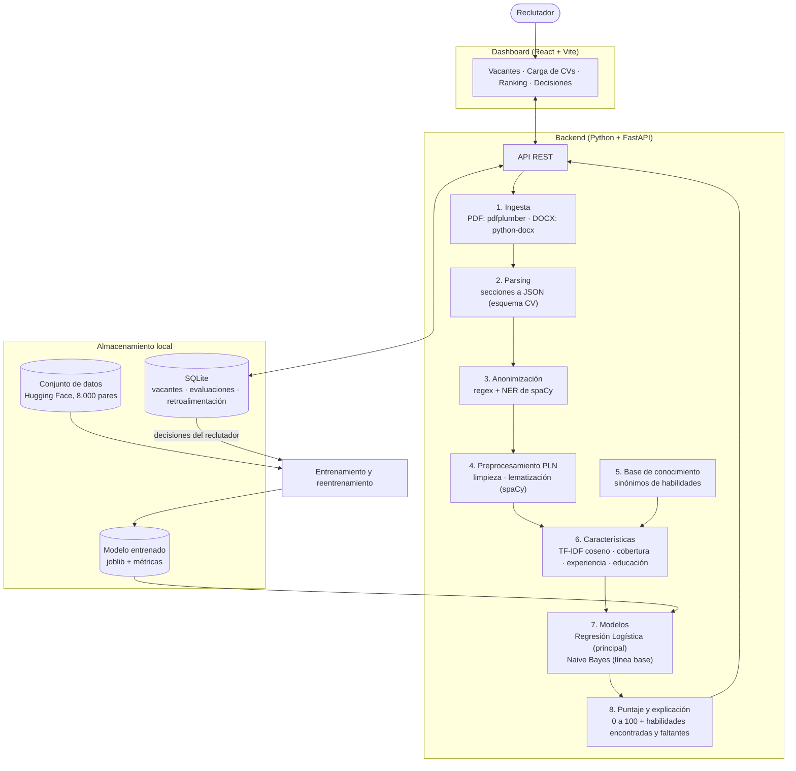

# Arquitectura del sistema

Fase 1 del cronograma. Los requerimientos que esta arquitectura cumple están en
[requisitos.md](requisitos.md).

## 1. Vista general

El sistema es un **agente basado en aprendizaje** (actividades 2.1 y 2.2): percibe currículums y
vacantes, los procesa con PLN y una base de conocimiento, decide un puntaje con modelos de
aprendizaje automático, actúa mostrando un ranking y aprende de la retroalimentación del
reclutador.

El diagrama también está exportado como imagen en [arquitectura.png](arquitectura.png) para
usarlo en los reportes.



## 2. Componentes del agente

Relación entre los componentes del agente (actividades 2.1, 2.2 y 3.1) y los módulos del
sistema:

| Componente del agente | Módulos | Fase |
|---|---|---|
| Sensores | Carga de PDF y DOCX, captura de vacantes, registro de decisiones del reclutador | 3, 7 |
| Módulo de percepción | Ingesta, parsing de secciones, anonimización | 3, 4 |
| Procesamiento de conocimiento | Preprocesamiento PLN y base de conocimiento de habilidades | 4, 6 |
| Módulo de aprendizaje | TF-IDF, Naive Bayes, Regresión Logística, reentrenamiento | 5, 8 |
| Actuadores | Puntaje, explicación, ranking, filtros y métricas en el dashboard | 6, 7 |

## 3. Módulos

| # | Módulo | Entrada | Salida | Fase | Responsable |
|---|---|---|---|---|---|
| 1 | Ingesta | Archivo PDF o DOCX | Texto plano o error por archivo | 3 | Raúl |
| 2 | Parsing | Texto plano | `CV` en JSON con secciones | 3 | Raúl |
| 3 | Anonimización | `CV` | `CV` sin datos personales | 2, 4 | Eduardo, Oziel |
| 4 | Preprocesamiento PLN | Texto | Tokens lematizados sin palabras vacías | 4 | Oziel |
| 5 | Base de conocimiento | Habilidades en texto libre | Habilidades normalizadas | 4, 6 | Oziel |
| 6 | Características | `CV` + `Vacancy` | Las cuatro características de requisitos.md, sección 5 | 5, 6 | Oziel |
| 7 | Modelos | Características + TF-IDF | Probabilidad por clase | 5 | Oziel |
| 8 | Puntaje y explicación | Probabilidades + características | `Evaluation` | 6 | Oziel |
| 9 | API REST | Peticiones HTTP | JSON | 6 | Raúl |
| 10 | Dashboard | API REST | Interfaz web | 7 | Aldo |
| 11 | Almacenamiento | Vacantes, evaluaciones, decisiones | SQLite | 6, 8 | Eduardo |

Los responsables siguen los roles de la actividad 1.3; Ariel coordina la integración (fase 8).

## 4. Contratos de datos

Los contratos se definen como modelos de Pydantic en `src/cv_screening/schemas.py` (fase 2), y de
ahí se exporta el esquema JSON que usa el dashboard. Los nombres de campos están en inglés.

`Evaluation`, lo que el dashboard recibe por cada candidato:

```json
{
  "candidate_id": "c-0042",
  "vacancy_id": "v-0003",
  "file_name": "cv_0042.pdf",
  "score": 78.4,
  "predicted_class": "Good Fit",
  "probabilities": { "Good Fit": 0.64, "Potential Fit": 0.29, "No Fit": 0.07 },
  "features": {
    "text_similarity": 0.41,
    "skill_coverage": 0.8,
    "experience_fit": 1.0,
    "education_fit": 1.0
  },
  "matched_skills": ["python", "sql", "excel"],
  "missing_skills": ["tableau"],
  "years_experience": 4,
  "education_level": "bachelor",
  "recruiter_decision": null
}
```

`CV` (salida del parsing): `candidate_id`, `file_name`, `raw_text` y `sections` con `summary`,
`experience`, `education`, `skills` y `other`.

`Vacancy`: `vacancy_id`, `title`, `description`, `required_skills`, `preferred_skills`,
`min_years_experience`, `min_education_level`.

## 5. API REST (propuesta)

| Método | Ruta | Uso | RF |
|---|---|---|---|
| POST | `/vacancies` | Crear vacante | RF-01 |
| GET | `/vacancies`, `/vacancies/{id}` | Consultar vacantes | RF-01 |
| POST | `/vacancies/{id}/resumes` | Cargar un lote de CVs (multipart) y evaluarlos | RF-02 a RF-09 |
| GET | `/vacancies/{id}/ranking` | Ranking con filtros | RF-10 |
| PUT | `/evaluations/{id}/decision` | Registrar la decisión del reclutador | RF-11 |
| POST | `/model/retrain` | Reentrenar con la retroalimentación | RF-12 |
| GET | `/model/metrics` | Métricas del modelo vigente | RF-13 |

## 6. Librerías y entorno

Versiones verificadas al instalar el proyecto el 2 de octubre de 2026 con Python 3.14.7.

| Necesidad | Elección | Versión | Motivo |
|---|---|---|---|
| Lenguaje | Python | 3.12 o superior | Ecosistema estándar de PLN y aprendizaje automático. |
| Texto de PDF | pdfplumber | 0.11.10 | Extrae texto respetando el orden de las líneas; licencia MIT. |
| Texto de DOCX | python-docx | 1.x | Lee párrafos y tablas de Word; licencia MIT. |
| PLN | spaCy + `en_core_web_sm` | 3.8.16 / 3.8.0 | Lematización y reconocimiento de entidades (personas, organizaciones, fechas) para anonimizar. |
| Modelos | scikit-learn | 1.9.1 | `TfidfVectorizer`, `MultinomialNB`, `LogisticRegression` y métricas en una sola librería. |
| Datos | pandas, huggingface-hub | 3.0.6 | Descarga y manejo del conjunto de datos. |
| Contratos | Pydantic | 2.13.5 | Validación y esquema JSON compartido entre backend y dashboard. |
| API | FastAPI + Uvicorn | 0.142.2 | API REST con documentación automática (`/docs`) a partir de los modelos de Pydantic. |
| Almacenamiento | SQLite | incluida en Python | Un solo archivo local, sin servidor que instalar. |
| Dashboard | React + Vite + TypeScript | se fija en la fase 7 | Interfaz web con control total del diseño del ranking. |
| Calidad | pytest, ruff | | Pruebas y estilo en cada cambio (RNF-06). |

## 7. Estructura del repositorio (objetivo)

```
docs/                  requerimientos, arquitectura, decisiones
data/                  scripts de descarga y preparación (fase 2); datos generados fuera de Git
  samples/             CVs de prueba ficticios en PDF y DOCX
src/cv_screening/
  schemas.py           contratos de datos (fase 2)
  ingestion.py         lectura de PDF y DOCX (fase 3)
  parsing.py           secciones del CV (fase 3)
  anonymization.py     eliminación de datos personales (fases 2 y 4)
  preprocessing.py     PLN (fase 4)
  knowledge/           base de conocimiento de habilidades (fases 4 y 6)
  features.py          características CV-vacante (fases 5 y 6)
  models.py            entrenamiento, evaluación y predicción (fase 5)
  storage.py           SQLite (fases 6 y 8)
  api.py               FastAPI (fase 6)
frontend/              dashboard React (fase 7)
models/                modelos entrenados (fuera de Git)
tests/                 pruebas
```

## 8. Decisiones

| # | Decisión | Motivo | Alternativa descartada |
|---|---|---|---|
| D1 | CVs y vacantes en inglés; interfaz y documentación en español. | El único conjunto de datos público etiquetado encontrado está en inglés. | CVs en español con datos sintéticos o traducidos: etiquetas menos confiables y más trabajo. |
| D2 | Clasificar pares CV-vacante (Good, Potential, No Fit) en lugar de clasificar CVs por categoría. | Corresponde directamente al puntaje de idoneidad y hay etiquetas para entrenarlo. | Clasificar por área profesional: no responde si el candidato encaja en la vacante. |
| D3 | Base de conocimiento de sinónimos de habilidades además de TF-IDF. | TF-IDF solo compara palabras y no reconoce equivalencias como "spreadsheets" y "excel". | Embeddings con redes neuronales: fuera del enfoque de aprendizaje automático tradicional definido en la actividad 1.3. |
| D4 | Backend FastAPI y dashboard React separados. | Contrato JSON claro entre el motor y la interfaz; cada parte se desarrolla en paralelo. | Streamlit: más rápido de construir, pero con poco control sobre la interfaz. |
| D5 | Todo se ejecuta localmente con SQLite. | Privacidad de los CVs (RNF-01) y cero costo de infraestructura. | Base de datos o despliegue en la nube: fuera de alcance. |
| D6 | Repositorio de código separado del repositorio del curso. | Lo comparte todo el equipo en GitHub. | Código dentro de la carpeta del curso. |
